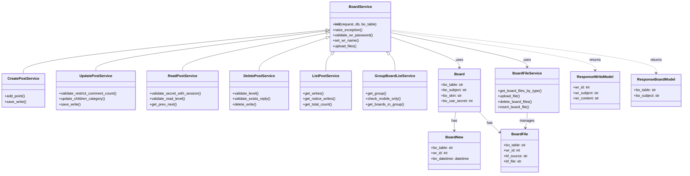

```mermaid
classDiagram
    class BoardService {
        +__init__(request, db, bo_table)
        +raise_exception()
        +validate_wr_password()
        +set_wr_name()
        +upload_files()
    }

    class CreatePostService {
        +add_point()
        +save_write()
    }

    class UpdatePostService {
        +validate_restrict_comment_count()
        +update_children_category()
        +save_write()
    }

    class ReadPostService {
        +validate_secret_with_session()
        +validate_read_level()
        +get_prev_next()
    }

    class DeletePostService {
        +validate_level()
        +validate_exists_reply()
        +delete_write()
    }

    class ListPostService {
        +get_writes()
        +get_notice_writes()
        +get_total_count()
    }

    class BoardFileService {
        +get_board_files_by_type()
        +upload_file()
        +delete_board_files()
        +insert_board_file()
    }

    class GroupBoardListService {
        +get_group()
        +check_mobile_only()
        +get_boards_in_group()
    }

    %% Database Models
    class Board {
        +bo_table: str
        +bo_subject: str
        +bo_skin: str
        +bo_use_secret: int
    }

    class BoardFile {
        +bo_table: str
        +wr_id: int
        +bf_source: str
        +bf_file: str
    }

    class BoardNew {
        +bo_table: str
        +wr_id: int
        +bn_datetime: datetime
    }

    %% Relationships
    BoardService <|-- CreatePostService
    BoardService <|-- UpdatePostService
    BoardService <|-- ReadPostService
    BoardService <|-- DeletePostService
    BoardService <|-- ListPostService
    BoardService <|-- GroupBoardListService
    
    BoardService --> Board: uses
    BoardService --> BoardFileService: uses
    BoardFileService --> BoardFile: manages
    Board --> BoardNew: has
    Board --> BoardFile: has

    %% API Models
    class ResponseWriteModel {
        +wr_id: int
        +wr_subject: str
        +wr_content: str
    }

    class ResponseBoardModel {
        +bo_table: str
        +bo_subject: str
    }

    BoardService ..> ResponseWriteModel: returns
    BoardService ..> ResponseBoardModel: returns
```
